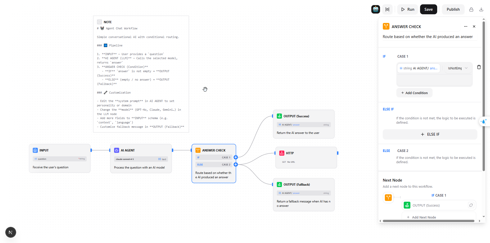

# workflow-AI

A standalone **AI Workflow Designer** built with Next.js 16, shadcn/ui, and Vercel AI SDK. Design, configure, and execute multi-step AI workflows visually using a drag-and-drop canvas.



---

## Features

- **Visual workflow canvas** powered by `@xyflow/react` (ReactFlow)
- **9 node types** — Input, Output, LLM, Condition, HTTP, Tool, Template, Code, Note
- **Right-click canvas** to search and add nodes instantly
- **Real-time execution** — streaming events with live node status (running → success/fail)
- **Vercel AI Gateway** — one key for all providers (OpenAI, Anthropic, Google, xAI, Meta…)
- **Variable mention system** — reference outputs from other nodes using `@mentions`
- **JSON Schema editor** — define typed output schemas per node
- **Condition branching** — if / else logic with AND/OR operators
- **Keyboard delete** — select node → Delete/Backspace
- **Auto-layout** — BFS-based node arrangement
- **Cycle detection** — prevents invalid circular connections
- **Dark/light theme** — via `next-themes`
- **Built-in templates** — Agent Chat, Get Weather, Baby Research pre-loaded

---

## Tech Stack

| Layer | Technology |
|-------|-----------|
| Framework | Next.js 16.1 (App Router, Turbopack) |
| UI Components | shadcn/ui (new-york style) |
| Styling | Tailwind CSS v4 |
| Canvas | @xyflow/react (ReactFlow) |
| AI SDK | Vercel AI SDK (`ai`, `@ai-sdk/openai`) |
| AI Gateway | Vercel AI Gateway (100+ models, 1 key) |
| State | Zustand |
| Data Fetching | SWR |
| Rich Text | TipTap (mention + suggestion) |

---

## Getting Started

### Prerequisites

- Node.js >= 18
- pnpm >= 9

### Installation

```bash
git clone https://github.com/nguyenngocdue/workflow-AI.git
cd workflow-AI
pnpm install
```

### Environment Variables

Create `.env.local`:

```bash
# Option A — Vercel AI Gateway (recommended: all providers with 1 key)
# Get key at: https://vercel.com/ai-gateway
AI_GATEWAY_API_KEY=your_gateway_key

# Option B — Direct provider keys
OPENAI_API_KEY=sk-...
# ANTHROPIC_API_KEY=
# GOOGLE_GENERATIVE_AI_API_KEY=
```

### Run

```bash
pnpm dev        # http://localhost:6001
pnpm build
pnpm start
```

---

## Node Types

### INPUT
**Entry point of the workflow.** Defines the input schema — all fields declared here are available as `@mention` variables in downstream nodes.

```json
// Example output schema
{ "question": "string", "language": "string" }
```

- Required: exactly 1 per workflow
- Cannot be deleted (entry point protection)
- All downstream nodes reference its fields via `@INPUT.fieldName`

---

### LLM (AI Agent)
**Calls an AI language model.** Supports any model available through Vercel AI Gateway or direct provider keys.

```
Provider    Model examples
────────    ─────────────────────────────────
openai      gpt-4o, gpt-4o-mini, o3-mini, o1
anthropic   claude-3-7-sonnet, claude-3-5-haiku
google      gemini-2.0-flash, gemini-2.5-pro
xai         grok-2, grok-3-mini
meta        llama-3.3-70b, llama-4-scout
```

**Config:**
- **System prompt** — set the AI's role/persona
- **User message** — supports `@mention` to inject values from previous nodes
- **Output schema** — define what fields the model should return (structured output)
- **Model selector** — switch provider/model without changing the prompt

**Execution:**
1. Resolves all `@mention` placeholders to actual values
2. Calls `generateText()` via Vercel AI Gateway
3. Returns structured output matching the output schema

---

### CONDITION (If / Else)
**Routes execution to different branches** based on conditions evaluated at runtime.

```
CONDITION node
   ├── IF   branch → connects to one set of nodes
   └── ELSE branch → connects to another set of nodes
```

**Operators available:**
- `is_empty` / `is_not_empty`
- `equals` / `not_equals`
- `contains` / `not_contains`
- `greater_than` / `less_than`

**Config:**
- Source: pick any field from any upstream node's output
- Multiple conditions with AND / OR logical operators
- Unlimited `else-if` branches

---

### OUTPUT
**Exit point of the workflow.** Maps fields from upstream node outputs to the final result.

```json
// Example mapping
{ "answer": "@AI_AGENT.answer", "language": "@INPUT.language" }
```

- Multiple OUTPUT nodes supported (e.g., one per condition branch)
- Fields are merged into the final `WORKFLOW_END` result

---

### HTTP
**Makes external API calls.** Supports GET, POST, PUT, PATCH, DELETE.

**Config:**
- URL, method, headers, query params, body
- All values support `@mention` — inject dynamic data from upstream nodes
- Timeout configurable
- Output schema: `{ response: { status, ok, body, headers, duration } }`

---

### TOOL
**Runs an AI tool / function call.** Uses the model's native function-calling capability to invoke registered tools (MCP tools or app tools).

**Config:**
- Select tool from registered list
- Provide message context (supports `@mention`)
- Model selector (tool-calling capable models only)

---

### TEMPLATE
**Generates text with variable interpolation.** Useful for building dynamic prompts, emails, reports, or any formatted text before passing to an LLM.

```
Hello {{@INPUT.name}}, your order {{@HTTP.response.body.orderId}} is ready.
```

---

### CODE *(coming soon)*
**Executes a JavaScript/Python code block** with access to upstream node outputs as variables.

---

### NOTE
**Sticky note / annotation.** Rendered as Markdown on the canvas. Not executed. Use for documenting workflow logic or leaving instructions.

---

## Execution Flow

```
User fills INPUT fields in Execute Tab
        ↓
allNodeValidate()   — check for missing configs
        ↓
POST /api/workflow/:id/execute  { query: { ... } }
        ↓
Server:
  1. Load nodes + edges from store
  2. topoSort() → determine execution order
  3. Open ReadableStream

  For each node (in order):
  ┌─────────────────────────────────────────┐
  │ emit NODE_START                         │
  │                                         │
  │ INPUT    → pass query as output         │
  │ LLM      → resolve @mentions            │
  │             → call AI Gateway           │
  │             → return { answer: ... }    │
  │ CONDITION→ evaluate conditions          │
  │             → set branch = "if"/"else"  │
  │ OUTPUT   → collect upstream values      │
  │ HTTP     → fetch external API           │
  │ TEMPLATE → interpolate variables        │
  │                                         │
  │ emit NODE_END (isOk: true/false)        │
  └─────────────────────────────────────────┘

  emit WORKFLOW_END  { output, histories }

Client (real-time):
  NODE_START → node turns blue (spinner)
  NODE_END   → node turns green ✓ or red ✗
  WORKFLOW_END → Result tab shows final output
```

---

## Canvas Shortcuts

| Action | How |
|--------|-----|
| Add node | Right-click canvas → search |
| Delete node | Select → `Delete` or `Backspace` |
| Delete node (menu) | Right-click node → Delete |
| Connect nodes | Drag from `+` handle on right side |
| Select multiple | Click + drag selection box |
| Pan | Click + drag on empty canvas |
| Zoom | Scroll wheel |
| Fit view | `Ctrl+Shift+H` |

---

## Built-in Templates

| Template | Flow |
|----------|------|
| 🤖 **Agent Chat** | INPUT → LLM → CONDITION → 2× OUTPUT |
| 🌤️ **Get Weather** | INPUT → LLM (geocode) → HTTP (weather API) → OUTPUT |
| 👨🏻‍🔬 **Baby Research** | INPUT → multi-step search + analysis → OUTPUT |

Templates are pre-seeded on server start — available immediately at `/workflow`.

---

## Project Structure

```
src/
├── app/
│   ├── (workflow)/workflow/
│   │   ├── page.tsx                   # Workflow list
│   │   └── [id]/page.tsx              # Canvas editor
│   ├── api/workflow/
│   │   ├── route.ts                   # GET list / POST create
│   │   └── [id]/
│   │       ├── route.ts               # GET / PUT / DELETE
│   │       ├── structure/route.ts     # GET + POST (delta save)
│   │       └── execute/route.ts       # POST → streaming execution
│   └── store/
│       ├── index.ts                   # appStore (chatModel)
│       └── workflow.store.ts          # useWorkflowStore
│
├── components/workflow/
│   ├── workflow.tsx                   # ReactFlow canvas + right-click search
│   ├── canvas-node-search.tsx         # Right-click node picker (portal)
│   ├── default-node.tsx               # Universal node renderer
│   ├── node-context-menu-content.tsx  # Right-click node menu (delete)
│   └── node-config/                   # Per-kind config panels
│
├── lib/
│   ├── ai/
│   │   ├── models.ts                  # customModelProvider + AI Gateway
│   │   └── workflow/
│   │       ├── workflow.interface.ts  # All TypeScript types
│   │       ├── shared.workflow.ts     # Converters + stream helpers
│   │       ├── examples/              # Built-in templates
│   │       └── executor/              # DAG execution engine
│   └── mock/
│       └── store.ts                   # In-memory store (seeded from templates)
│
└── types/
    ├── workflow.ts                    # DBWorkflow, DBNode, DBEdge
    └── util.ts                        # ObjectJsonSchema7, TipTapMentionJsonContent
```

---

## Mock Services

Runs fully in-memory — no database required.

| Service | Location | Notes |
|---------|----------|-------|
| Workflows | `src/lib/mock/store.ts` | In-memory, seeded with templates on start |
| Auth | `src/lib/auth/client.ts` | Always returns mock user |
| Models list | `src/app/api/chat/models/route.ts` | Static list, `hasAPIKey` from env vars |
| MCP tools | `src/hooks/queries/use-mcp-list.ts` | Returns `[]` |
